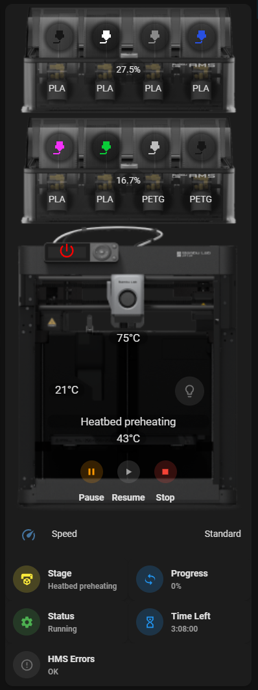
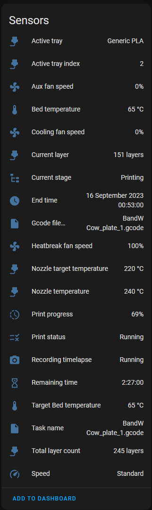
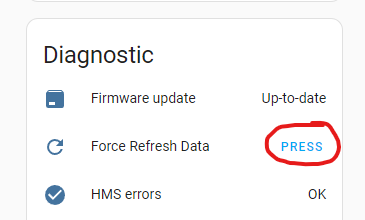
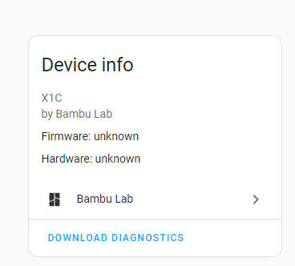
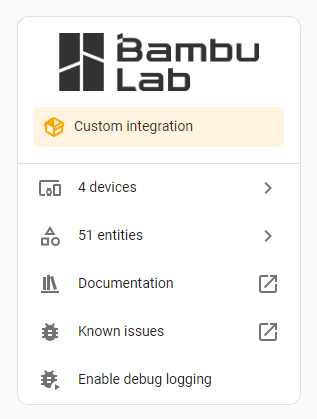

# Bambu Lab

A Home Assistant Integration for Bambu Lab printers

## Contribution

Want to contribute to ha-bambulab? Great!  We have a few small asks though!

- Please do not fork and PR against the `main` branch
- Use the `develop` branch, this is our working area. Anything in the `main` branch should be considered live, released
  code.
- Please name your commits accordingly, and add some context as to what you have added.

## Setup

To install, add this Github Repo to the HACS Custom Repositories, or click the badge above.

For now, you will need the following information:

- Printer IP
- LAN Access Code (Can be found on the Printer settings)
- Serial Number (Can be found in the printer settings or in Bambu Studio)

### Setup using OAuth

If you signed up using any OAuth method, you need to set a password for your Bambu Cloud account:

- Login to the Bambu mobile app using OAuth.
- Tap the person icon at the bottom right.
- Tap Account Security > Change Password

This will allow you to set a password. Now you can login to the HA integration using your Bambu username and password
instead of OAuth.

## Features

### Sensors

| Sensor                    | X1C                | X1                 | P1P                | P1S                | A1 Mini            | 
|---------------------------|--------------------|--------------------|--------------------|--------------------|--------------------|
| Aux Fan Speed             | :white_check_mark: | :white_check_mark: | :white_check_mark: | :white_check_mark: | :white_check_mark: |
| Bed Temperature           | :white_check_mark: | :white_check_mark: | :white_check_mark: | :white_check_mark: | :white_check_mark: |
| Chamber Fan Speed         | :white_check_mark: | :white_check_mark: | :white_check_mark: | :white_check_mark: | :x:                |
| Chamber Temperature       | :white_check_mark: | :white_check_mark: | :x:                | :x:                | :x:                |
| Cooling Fan Speed         | :white_check_mark: | :white_check_mark: | :white_check_mark: | :white_check_mark: | :white_check_mark: |
| Current Layer             | :white_check_mark: | :white_check_mark: | :white_check_mark: | :white_check_mark: | :white_check_mark: |
| Current Stage             | :white_check_mark: | :white_check_mark: | :white_check_mark: | :white_check_mark: | :white_check_mark: |
| End Time                  | :white_check_mark: | :white_check_mark: | :white_check_mark: | :white_check_mark: | :white_check_mark: |
| Heatbreak Fan Speed       | :white_check_mark: | :white_check_mark: | :white_check_mark: | :white_check_mark: | :white_check_mark: |
| Nozzle Target Temperature | :white_check_mark: | :white_check_mark: | :white_check_mark: | :white_check_mark: | :white_check_mark: |
| Nozzle Temperature        | :white_check_mark: | :white_check_mark: | :white_check_mark: | :white_check_mark: | :white_check_mark: |
| Print Progress            | :white_check_mark: | :white_check_mark: | :white_check_mark: | :white_check_mark: | :white_check_mark: |
| Print Status              | :white_check_mark: | :white_check_mark: | :white_check_mark: | :white_check_mark: | :white_check_mark: |
| Remaining Time            | :white_check_mark: | :white_check_mark: | :white_check_mark: | :white_check_mark: | :white_check_mark: |
| Speed Profile             | :white_check_mark: | :white_check_mark: | :white_check_mark: | :white_check_mark: | :white_check_mark: |
| Start Time                | :white_check_mark: | :white_check_mark: | :white_check_mark: | :white_check_mark: | :white_check_mark: |
| Target Bed Temperature    | :white_check_mark: | :white_check_mark: | :white_check_mark: | :white_check_mark: | :white_check_mark: |
| Total Layer Count         | :white_check_mark: | :white_check_mark: | :white_check_mark: | :white_check_mark: | :white_check_mark: |
| Timelapse Active          | :white_check_mark: | :white_check_mark: | :white_check_mark: | :white_check_mark: | :white_check_mark: |

Notes:

- If AMS(s) are present, additional 'Active tray index' and 'Active tray' sensors are present on the Printer device.
- Start time on the P1P/S is simulated since the printer itself doesn't track that so the integration must be running
  when the print starts.

### Lights

| Light         | X1C                | X1                 | P1P                | P1S                | A1 Mini            |    
|---------------|--------------------|--------------------|--------------------|--------------------|--------------------|
| Chamber Light | :white_check_mark: | :white_check_mark: | :white_check_mark: | :white_check_mark: | :white_check_mark: |

### Buttons

This currently exposes the following Buttons:

| Button | X1C                | X1                 | P1P                | P1S                | A1 Mini            |
|--------|--------------------|--------------------|--------------------|--------------------|--------------------|
| Pause  | :white_check_mark: | :white_check_mark: | :white_check_mark: | :white_check_mark: | :white_check_mark: |
| Resume | :white_check_mark: | :white_check_mark: | :white_check_mark: | :white_check_mark: | :white_check_mark: |
| Stop   | :white_check_mark: | :white_check_mark: | :white_check_mark: | :white_check_mark: | :white_check_mark: |

### AMS

| Sensor           | X1C                | X1                 | P1P                | P1S                | A1 Mini            |
|------------------|--------------------|--------------------|--------------------|--------------------|--------------------|
| Humidity Index   | :white_check_mark: | :white_check_mark: | :white_check_mark: | :white_check_mark: | :white_check_mark: |
| Tray 1           | :white_check_mark: | :white_check_mark: | :white_check_mark: | :white_check_mark: | :white_check_mark: |
| Tray 2           | :white_check_mark: | :white_check_mark: | :white_check_mark: | :white_check_mark: | :white_check_mark: |
| Tray 3           | :white_check_mark: | :white_check_mark: | :white_check_mark: | :white_check_mark: | :white_check_mark: |
| Tray 4           | :white_check_mark: | :white_check_mark: | :white_check_mark: | :white_check_mark: | :white_check_mark: |
| Tray Attributes: |                    |                    |                    |                    |                    |
| Active           | :white_check_mark: | :white_check_mark: | :white_check_mark: | :white_check_mark: | :white_check_mark: |
| Color            | :white_check_mark: | :white_check_mark: | :white_check_mark: | :white_check_mark: | :white_check_mark: |
| Empty            | :white_check_mark: | :white_check_mark: | :white_check_mark: | :white_check_mark: | :white_check_mark: |
| K Value          | :x:                | :x:                | :white_check_mark: | :white_check_mark: | :white_check_mark: |
| Max Nozzle Temp  | :white_check_mark: | :white_check_mark: | :white_check_mark: | :white_check_mark: | :white_check_mark: |
| Min Nozzle Temp  | :white_check_mark: | :white_check_mark: | :white_check_mark: | :white_check_mark: | :white_check_mark: |
| Name             | :white_check_mark: | :white_check_mark: | :white_check_mark: | :white_check_mark: | :white_check_mark: |
| Type             | :white_check_mark: | :white_check_mark: | :white_check_mark: | :white_check_mark: | :white_check_mark: |

### External Spool

| Sensor          | X1C                | X1                 | P1P                | P1S                | A1 Mini            |
|-----------------|--------------------|--------------------|--------------------|--------------------|--------------------|
| External Spool  | :white_check_mark: | :white_check_mark: | :white_check_mark: | :white_check_mark: | :white_check_mark: |
| Attributes:     |                    |                    |                    |                    |                    |
| Active          | :white_check_mark: | :white_check_mark: | :white_check_mark: | :white_check_mark: | :white_check_mark: |
| Color           | :white_check_mark: | :white_check_mark: | :white_check_mark: | :white_check_mark: | :white_check_mark: |
| K Value         | :x:                | :x:                | :white_check_mark: | :white_check_mark: | :white_check_mark: |
| Max Nozzle Temp | :white_check_mark: | :white_check_mark: | :white_check_mark: | :white_check_mark: | :white_check_mark: |
| Min Nozzle Temp | :white_check_mark: | :white_check_mark: | :white_check_mark: | :white_check_mark: | :white_check_mark: |
| Name            | :white_check_mark: | :white_check_mark: | :white_check_mark: | :white_check_mark: | :white_check_mark: |
| Type            | :white_check_mark: | :white_check_mark: | :white_check_mark: | :white_check_mark: | :white_check_mark: |

### Diagnostics

This currently exposes the following Diagnostic Sensors:

| Sensor        | X1C                | X1                 | P1P                | P1S                | A1 Mini            |
|---------------|--------------------|--------------------|--------------------|--------------------|--------------------|
| Wifi Signal   | :white_check_mark: | :white_check_mark: | :white_check_mark: | :white_check_mark: | :white_check_mark: |
| HMS Errors    | :white_check_mark: | :white_check_mark: | :white_check_mark: | :white_check_mark: | :white_check_mark: |
| Attributes:   |                    |                    |                    |                    |                    |
| Count         | :white_check_mark: | :white_check_mark: | :white_check_mark: | :white_check_mark: | :white_check_mark: |
| 1-Error       | :white_check_mark: | :white_check_mark: | :white_check_mark: | :white_check_mark: | :white_check_mark: |
| 1-Wiki        | :white_check_mark: | :white_check_mark: | :white_check_mark: | :white_check_mark: | :white_check_mark: |
| 2-Error       | :white_check_mark: | :white_check_mark: | :white_check_mark: | :white_check_mark: | :white_check_mark: |
| 2-Wiki        | :white_check_mark: | :white_check_mark: | :white_check_mark: | :white_check_mark: | :white_check_mark: |
| ... and so on |                    |                    |                    |                    |                    |

### Cameras

| Camera  | X1C                | X1                 | P1P                | P1S                | A1 Mini            |
|---------|--------------------|--------------------|--------------------|--------------------|--------------------|
| Chamber | :white_check_mark: | :white_check_mark: | :white_check_mark: | :white_check_mark: | :white_check_mark: |

P1P/P1S/A1 Mini only support the chamber camera when connected by the local LAN connection mode.

### Automation device triggers

This integration implements a handful of device triggers to make some common automation scenarios a little easier.
See [device triggers](docs/DeviceTrigger.md).

### WLED Lights

Support for adding LED chamber lights via the [WLED](https://kno.wled.ge/).

- Requires the [WLED Home Assistant Integration](https://www.home-assistant.io/integrations/wled/) and the requisite LED
  lights and ESP device.
- Clink the link below to import the WLED blueprint

#### WLED Features

- LED lights automatically turn off when Bambu Lida is in use so as to not interfere
- LED lights turn red when there is an error in the printer
- LED lights turn blue when bed is auto leveling
- LED lights turn green when print is finished

## Example dashboard

You can find an amazing web configurator to easily create a Dashboard for your Bambu printer like the one below
at https://www.wolfwithsword.com/bambulab-home-assistant-dashboard/.

## Issues

### Diagnostic File

If you run into any issues, we now have built in diagnostics.  
To grab the latest information, hit the "Force Refresh Data" button under the Diagnostic section.

Then on the device info page for the printer entity, you will see a "Download Diagnostics" button.
Make sure you upload this to your Bug ticket

### Debug Logging

When logging a bug, always ensure you send us the debug logs. These can be enabled from the Integration page itself.
The debug logs will appear in the standard Home Assistant logs

