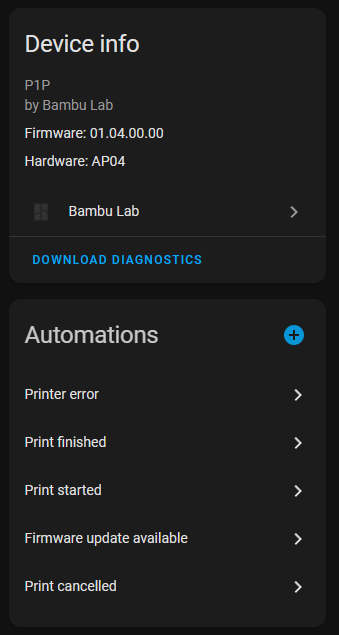
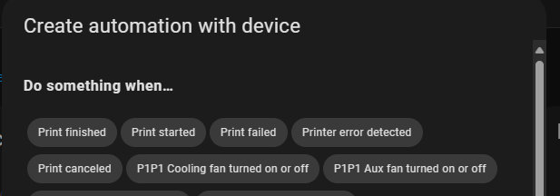
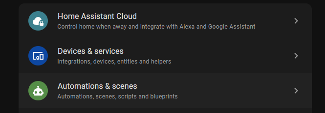
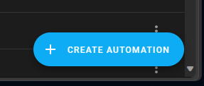
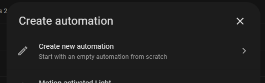
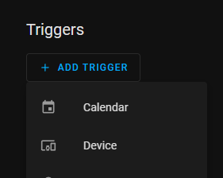
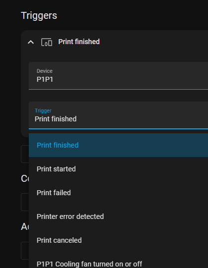

# Device Triggers

This integration implements a handful of device triggers to make some automation scenarios a little easier to achieve by point and click and without requiring a deeper understanding of the various sensors the printer exposes.
- Firmware update available
- Print canceled
- Print failed (X1 only)
- Print finished
- Print started
- Printer error detected. With data payloads:
    - hms_code
    - description
    - url (wiki link for error)

For the most part these are just conveniences - you could craft an automation triggering the same way but it takes a bit more effort to understand which sensor(s) to use to track the activity you want which requires understanding how the sensors behave & interact / what the available states are. The only one in the list that's not true for is the print canceled event as that's only a transient event from the printer rather than a persistent state. And the printer sensor that exposes HMS errors would likely be very hard to effectively handle correctly in the multi-error case. And even in the single error case getting at attributes to include in notification messages is a steep learning curve.

# Using Device Triggers

## Option 1 - from the device page

## Option 2 - from the general automations page

# Actions for Device Triggers

These can be whatever you like. The most interesting case is the 'Printer Error' trigger. This has three pieces of data payload in it:
- hms_code
- description
- url

These can be accessed using the Jinja2 templating syntax in the action. So for example if you wanted to trigger a notification you would be able to set the title text to

    'Printer Error: {{ trigger.event.data.hms_code }}'

and the message text to

    '{{ trigger.event.data.description }}'

Note that doing this will kick you out of the visual editor and into editing the raw yaml.